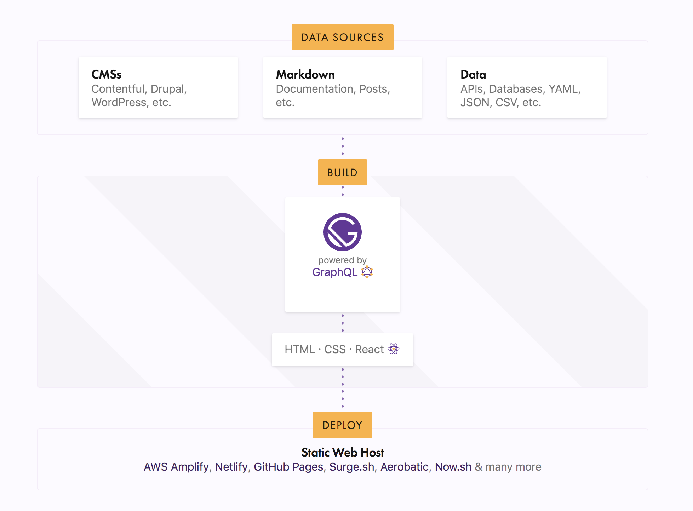

## What is it?

- Static site generator built on React
- Pull data from markdown, text, apis
- Takes data and creates super fast sites



## Why should I use it?

- Tonnes of starter packs
- Massive set of plugins
- Excellent documentation (great react intro)
- Fast + SEO optimized
- Entire directory already scafolded in starters

## Features
- No webpack set up needed
- Supports graphql out of the box
- Routing comes included
- Hot Reloading
- Cloud functions
- Form submissions

## Plugins - Tell me more

- Plugins for
  - seo (react helmet)
  - lazy load images
  - scss loader
  - google fond loader
  - markdown formatting
- Think of plugins as a way to remove monsterous webpack configs

Example:
```bash
npm install --save gatsby-transformer-remark
```
Then in your gatsby-config.js:
```js
plugins: [
  {
    resolve: `gatsby-transformer-remark`,
    options: {
      // CommonMark mode (default: true)
      commonmark: true,
      // Footnotes mode (default: true)
      footnotes: true,
      // Pedantic mode (default: true)
      pedantic: true,
      // GitHub Flavored Markdown mode (default: true)
      gfm: true,
      // Plugins configs
      plugins: [],
    },
  },
],
```


...... I have my gatsby site, now what?


## Netlify

- Hosting for static sites
- Free ssl (needed for .dev)
- Watch your repo + deploy
- Branches can deploy to a url
- Live stream local dev to test url
- Hook up to dns to allow for easy creation of subdomains, reverse proxy


## Deploy
1.  https://tcollins.dev/gatsby-with-netlify/

[](https://app.netlify.com/start/deploy?repository=https://github.com/gatsbyjs/gatsby-starter-blog)

2. Download your repo and install
```
npm install -g gatsby-cli
git clone https://github.com/{userName}/gatsby-starter-blog.git
cd gatsby-starter-blog/
npm i
vscode .
gatsby develop
```

3. Create a page - add file under `pages`
```jsx
import React from 'react'
export default () => {
    return <h1>
      Welcome to my site
    </h1>
};
```
4. Push to repo
```
git add .
git commit -m "my first page"
git push origin master
```
5. Go back to netlify site to view deploy

