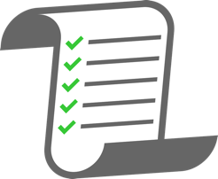

Recently our development team switched to scrum. Before we adopted scrum we using a more ad hoc process. We had the concept of tickets and rounds of review. There was however no strong process in place.

It has taken us a number of sprints to hone the process. Below are some of the lessons we learned along the way.

## Tasks over 2 days => split them up

We primarily estimate by tasks. Each story has a number of sub-tasks. We estimate each sub-task in days. The sum of these tasks is then compared to our capacity. The textbooks will likely recommend estimating using story points. This is, of course, a valid approach; however, estimating by days has been working great for us.

If a task is longer than two days, it’s an indication that there is some complexity hidden within the task. The longer the estimate, the greater the risk that you are underestimating the time required to complete this task. If you find yourself attaching an estimate of more than two days, ask yourself: what is making this task more complex? Look at how you can split this into two or more subtasks.

## Acceptance Tests are vital

 
 

One of the biggest advantages of using scrum for our team was the accuracy of requirements. Every story now has a set of acceptance tests that need to be completed in order for the story to be considered done.

An acceptance test should indicate the input and the expected output. They may also include that current state of the app. https://openclassrooms.com/en/courses/4544611-write-agile-documentation-user-stories-and-acceptance-tests/4810081-writing-acceptance-tests

The biggest advantage we saw with acceptance tests was that requirements were discussed upfront with our stakeholders. Questions, discussion, and clarifications happened at the planning stage rather than the implementation stage. This reduces the risk of bugs as well as underestimating tasks.

Having acceptance tests right there with the story is a godsend. It avoids the need to dig through docs or recall conversations on features.
Acceptance tests are also a great basis for unit tests.

## Code Review Often
A by-product of having smaller tasks is that you tend to have smaller commits and conversely a shorter code review cycle. Reducing the time pull requests stay in review keeps your cadence up, and reduces the risk of large changes being required for code review changes. Large code reviews tax the reviewer. Shorter reviews will get a more thorough review, line by line, which is going to greatly help with code quality.

Aim to have several code reviews each week, or even each day. You can stub our modules that are not yet implemented and communicate this with your reviewers.

## One Source of Truth
Have one source of truth. Your one source of truth should be your Scrum board. I've used physical whiteboards for this as well as digital boards.

JIRA is our source of truth but any tool you are comfortable with will work. Each story has all acceptance tests as well as links to copy docs, translations, videos, and designs. The key thing is that all assets live alongside the story itself. Gone are the days of trawling through slack conversations or emails. I can open the ticket and commence development right away.

If you use a physical board for your tickets, think about how you can manage your digital assets in an orderly way. You may elect to mirror this board in digital form. We use Google Drive, which hosts most of our content, and then link to specific Google documents in the JIRA ticket.

## Do your high-risk tasks first
Unknown tasks will always have the highest likelihood of hidden complexity. It’s best to approach tasks that may look the most unpleasant or the most complex early on in the project. If you are going to overrun a deadline it’s best to know early on.
Starting with your unknown tasks gives you the opportunity to discuss requirements with stakeholders. You will have more time to clarify issues with stakeholders and fix any blocker that may arise.

Examples of high-risk tasks are tasks that have business logic, tasks dealing with data, and tasks that are outside your domain of expertise.

## Demo & Deploy Often

 

Stick to your sprint demo schedule. Frequent demos help with communication with stakeholders. Deploying often reduces the risk of bugs being found in production.
I'm sure we have many more lessons to learn. We continually look to improve how we write software. Overall adopting scrums has been a huge win for our team and our stakeholders. By following the points above we've seen many benefits:

- Happier stakeholders - Stakeholders are kept in the loop and are more active in creating requirements
- Better estimation - We can now give clearer estimates to stakeholders and management. If we need more dev resources we can identify this early on.
- Planning - Acceptance tests are set in advance. The requirements of each feature are clear
- Happier developers - There is less context switching as all information is in JIRA.  Change requests go through the backlog and planning to reduce distractions during the sprint.

My advice to you if you are not yet using Scrum/Agile, is to try it out for one project. Give yourself a number of sprints and expect to improve over time. Talk to your stakeholders and management about the advantages to them. Document the process early on and follow this process as strictly as you can. As you continue with scrum you will refine and improve this process.
 

